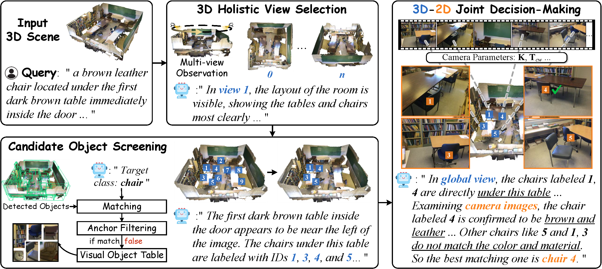

# SPAZER
SPAZER: Spatial-Semantic Progressive Reasoning Agent for Zero-shot 3D Visual Grounding (NeurIPS 2025)



### TODO
- [x] Release inference code
- [x] Publish evaluation results & logs
- [ ] Release data processing code
- [ ] Update README accordingly

## SPAZER Inference (NR3D & ScanRefer)

### Overview
- Two-step 3D referring inference powered by multi-view images and a VLM:
  - Step 1: View selection + Top-K object candidates
  - Step 2: Final target object ID prediction

### Requirements
- Python 3.8+
- PyTorch (install per your CUDA setup)
- Python packages:
```bash
pip install openai pillow numpy pandas tqdm nltk
```

### Data and Paths
- Ensure these exist or edit variables at the top of the scripts:
  - `data/scannet/scannetv2_val.txt`
  - `datasets/ScanNet/ScanRefer/ScanRefer_filtered_val.json`
  - `data/projection_img/scannet_v1`
  - `data/scannet/global_aligned_mesh_clean_2_filtered`
  - ScanRefer bbox
  - NR3D bbox

### OpenAI Setup
- Edit `API_KEY` at the top of `run_scanrefer.sh` and `run_nr3d.sh`:
  - `API_KEY="YOUR_API_KEY"`
- Useful parameters: `GPT_MODEL_TYPE`, `TEMPERATURE`, `TOP_P`, `N_TOPK`, `IMAGE_SIZE`, `SEED`, `EXP_NAME`.

### How to Run
- ScanRefer:
```bash
cd SPAZER/inference
bash run_scanrefer.sh
```
- NR3D:
```bash
cd SPAZER/inference
bash run_nr3d.sh
```

### Pipeline
- Step 1 (view selection + top-k): writes `output_${GPT_MODEL_TYPE}_${EXP_NAME}.json`
- Step 2 (object ID): reads `RESUME_FILE` from Step 1 and writes final results and messages in the same `OUTPUT_DIR`

### Outputs
- Results JSON: `$OUTPUT_DIR/output_${GPT_MODEL_TYPE}_${EXP_NAME}.json`
- Conversation logs: `$OUTPUT_DIR/${GPT_MODEL_TYPE}_messages_${EXP_NAME}/...`
- Run log: `$OUTPUT_DIR/log_${GPT_MODEL_TYPE}_${EXP_NAME}.txt`

### 🧩 Acknowledgement

This work builds upon several excellent open-source projects.  
We sincerely thank the following repositories for their valuable contributions and inspiration:

- [SeeGround](https://github.com/iris0329/SeeGround)
- [ZSVG3D](https://github.com/CurryYuan/ZSVG3D)
- [VLM-Grounder](https://github.com/InternRobotics/VLM-Grounder)
